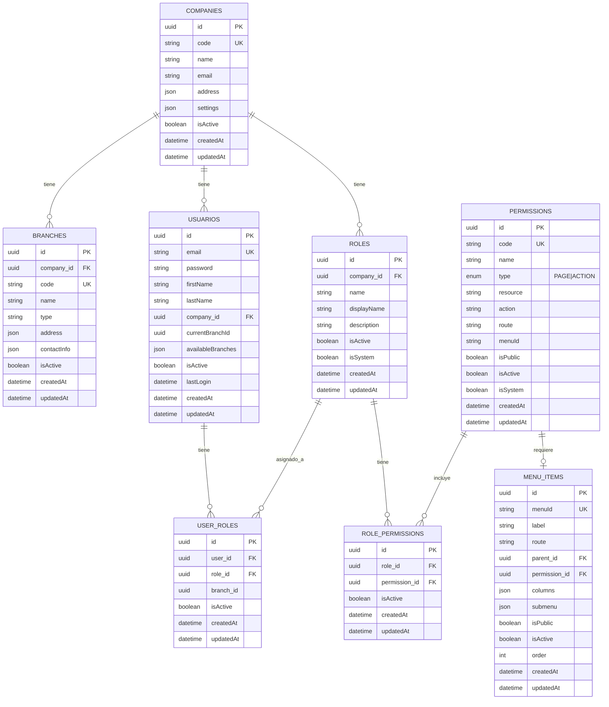

# 📊 Diagrama de Base de Datos - Sistema de Autorización

## 🎯 Descripción

Este documento muestra la estructura y relacionamiento lógico de las tablas del sistema de autorización implementado.

## 📐 Diagrama de Relaciones

### Diagrama Principal (Mermaid)



## 🔗 Descripción de Relaciones

### 1. **COMPANIES (Empresas)**
```
COMPANIES (1) ──< (N) BRANCHES
     │
     └──< (N) USUARIOS
     │
     └──< (N) ROLES
```

**Relaciones:**
- **COMPANIES → BRANCHES**: Una empresa puede tener múltiples sucursales (OneToMany)
- **COMPANIES → USUARIOS**: Una empresa puede tener múltiples usuarios (OneToMany)
- **COMPANIES → ROLES**: Una empresa puede tener múltiples roles (OneToMany)

### 2. **USUARIOS (Usuarios)**
```
USUARIOS (N) ──< USER_ROLES >── (N) ROLES
```

**Relaciones:**
- **USUARIOS ↔ ROLES**: Muchos a Muchos a través de `USER_ROLES`
  - Un usuario puede tener múltiples roles
  - Un rol puede ser asignado a múltiples usuarios
  - La relación puede ser específica por sucursal (`branch_id`)

### 3. **ROLES (Roles)**
```
ROLES (N) ──< ROLE_PERMISSIONS >── (N) PERMISSIONS
```

**Relaciones:**
- **ROLES ↔ PERMISSIONS**: Muchos a Muchos a través de `ROLE_PERMISSIONS`
  - Un rol puede tener múltiples permisos
  - Un permiso puede estar en múltiples roles

### 4. **PERMISSIONS (Permisos)**
```
PERMISSIONS (1) ──< (0..1) MENU_ITEMS
```

**Relaciones:**
- **PERMISSIONS → MENU_ITEMS**: Uno a Uno (opcional)
  - Un permiso puede tener un item de menú asociado
  - Un item de menú puede requerir un permiso específico

### 5. **MENU_ITEMS (Items del Menú)**
```
MENU_ITEMS (N) ──< (0..1) MENU_ITEMS [parent]
```

**Relaciones:**
- **MENU_ITEMS → MENU_ITEMS**: Auto-relación para jerarquía (parent_id)
  - Un item de menú puede tener un item padre
  - Permite crear submenús y menús jerárquicos

## 📊 Jerarquía Completa

```
COMPANIES (Raíz)
│
├── BRANCHES (Sucursales)
│   └── Depende de: COMPANIES
│
├── USUARIOS (Usuarios)
│   └── Depende de: COMPANIES
│   └── Relaciona con: ROLES (a través de USER_ROLES)
│
└── ROLES (Roles)
    └── Depende de: COMPANIES
    └── Relaciona con: PERMISSIONS (a través de ROLE_PERMISSIONS)
    └── Relaciona con: USUARIOS (a través de USER_ROLES)
    │
    └── PERMISSIONS (Permisos)
        └── Relaciona con: ROLES (a través de ROLE_PERMISSIONS)
        └── Relaciona con: MENU_ITEMS
        │
        └── MENU_ITEMS (Items del Menú)
            └── Depende de: PERMISSIONS (opcional)
            └── Relaciona con: MENU_ITEMS (parent, auto-relación)
```

## 🔑 Claves y Restricciones

### Claves Primarias (PK)
- Todas las tablas tienen `id` como UUID (Primary Key)

### Claves Foráneas (FK)
- `BRANCHES.company_id` → `COMPANIES.id`
- `USUARIOS.company_id` → `COMPANIES.id`
- `ROLES.company_id` → `COMPANIES.id`
- `USER_ROLES.user_id` → `USUARIOS.id`
- `USER_ROLES.role_id` → `ROLES.id`
- `ROLE_PERMISSIONS.role_id` → `ROLES.id`
- `ROLE_PERMISSIONS.permission_id` → `PERMISSIONS.id`
- `MENU_ITEMS.permission_id` → `PERMISSIONS.id` (nullable)
- `MENU_ITEMS.parent_id` → `MENU_ITEMS.id` (nullable, auto-relación)

### Claves Únicas (UK)
- `COMPANIES.code` - Código único de empresa
- `BRANCHES.code` - Código único de sucursal
- `USUARIOS.email` - Email único de usuario
- `PERMISSIONS.code` - Código único de permiso
- `MENU_ITEMS.menuId` - ID único del item del menú

## 📋 Flujo de Permisos

### Obtener Permisos de un Usuario

```
1. USUARIOS
   ↓
2. USER_ROLES (filtrar por user_id y isActive = true)
   ↓
3. ROLES (filtrar por role_id y isActive = true)
   ↓
4. ROLE_PERMISSIONS (filtrar por role_id y isActive = true)
   ↓
5. PERMISSIONS (filtrar por permission_id y isActive = true)
```

**Resultado:** Lista de permisos del usuario a través de sus roles activos.

### Verificar Acceso a una Ruta

```
1. MENU_ITEMS o PERMISSIONS (buscar por route)
   ↓
2. Verificar si isPublic = true
   ├── Si es público → Permitir acceso
   └── Si no es público → Verificar permisos del usuario
       ↓
3. Verificar si usuario tiene el permiso requerido
   ├── Si tiene permiso → Permitir acceso
   └── Si no tiene permiso → Denegar acceso
```

### Generar Menú Dinámico

```
1. Obtener todos los MENU_ITEMS (filtrar por isActive = true)
   ↓
2. Para cada item:
   ├── Si isPublic = true → Incluir en menú
   ├── Si permission_id existe → Verificar permisos del usuario
   │   ├── Si usuario tiene permiso → Incluir en menú
   │   └── Si usuario no tiene permiso → Excluir del menú
   └── Si no tiene permission_id → Incluir en menú
   ↓
3. Ordenar por 'order' y estructura jerárquica (parent_id)
```

## 📊 Tablas de Relación (Many-to-Many)

### USER_ROLES
**Propósito:** Relacionar usuarios con roles

**Campos:**
- `user_id` (FK) → USUARIOS.id
- `role_id` (FK) → ROLES.id
- `branch_id` (opcional) → BRANCHES.id (rol específico por sucursal)
- `isActive` → Indica si la relación está activa

**Casos de uso:**
- Un usuario puede tener múltiples roles
- Un rol puede ser asignado a múltiples usuarios
- Un usuario puede tener roles diferentes en diferentes sucursales

### ROLE_PERMISSIONS
**Propósito:** Relacionar roles con permisos

**Campos:**
- `role_id` (FK) → ROLES.id
- `permission_id` (FK) → PERMISSIONS.id
- `isActive` → Indica si la relación está activa

**Casos de uso:**
- Un rol puede tener múltiples permisos
- Un permiso puede estar en múltiples roles
- Permite crear roles con conjuntos de permisos específicos

## 🎨 Diagrama Visual Simplificado

```
┌─────────────┐
│  COMPANIES  │
└──────┬──────┘
       │
       ├─────────────────┬─────────────────┐
       │                 │                 │
       ▼                 ▼                 ▼
┌──────────┐      ┌──────────┐      ┌──────────┐
│ BRANCHES │      │ USUARIOS │      │  ROLES   │
└──────────┘      └─────┬────┘      └─────┬────┘
                        │                 │
                        │                 │
                  ┌─────▼─────────────────▼─────┐
                  │      USER_ROLES              │
                  │  (tabla intermedia)          │
                  └──────────┬───────────────────┘
                             │
                             │
                  ┌──────────▼──────────┐
                  │       ROLES         │
                  └──────────┬──────────┘
                             │
                             │
                  ┌──────────▼──────────────┐
                  │   ROLE_PERMISSIONS     │
                  │   (tabla intermedia)    │
                  └──────────┬──────────────┘
                             │
                             │
                  ┌──────────▼──────────┐
                  │    PERMISSIONS     │
                  └──────────┬──────────┘
                             │
                             │
                  ┌──────────▼──────────┐
                  │    MENU_ITEMS       │
                  │  (auto-relación)    │
                  └─────────────────────┘
```

## 📝 Notas Importantes

### 1. **Multiempresa**
- Todas las tablas principales están relacionadas con `COMPANIES`
- Los roles y permisos son específicos por empresa
- Un usuario pertenece a una empresa específica

### 2. **Multi-sucursal**
- Los usuarios pueden tener roles diferentes en diferentes sucursales
- El campo `branch_id` en `USER_ROLES` permite esta flexibilidad

### 3. **Permisos Públicos**
- Los permisos con `isPublic = true` no requieren autenticación
- Los items de menú con `isPublic = true` son visibles para todos

### 4. **Permisos del Sistema**
- Los permisos/roles con `isSystem = true` no se pueden eliminar
- Son esenciales para el funcionamiento del sistema

### 5. **Jerarquía de Menú**
- Los items de menú pueden tener un `parent_id` para crear jerarquías
- Los `columns` y `submenu` permiten estructuras complejas

## 🔍 Consultas Comunes

### Obtener todos los permisos de un usuario
```sql
SELECT DISTINCT p.*
FROM PERMISSIONS p
INNER JOIN ROLE_PERMISSIONS rp ON p.id = rp.permission_id
INNER JOIN ROLES r ON rp.role_id = r.id
INNER JOIN USER_ROLES ur ON r.id = ur.role_id
INNER JOIN USUARIOS u ON ur.user_id = u.id
WHERE u.id = ? 
  AND u.isActive = true
  AND r.isActive = true
  AND rp.isActive = true
  AND ur.isActive = true
  AND p.isActive = true;
```

### Verificar si un usuario tiene un permiso específico
```sql
SELECT COUNT(*) > 0 as hasPermission
FROM PERMISSIONS p
INNER JOIN ROLE_PERMISSIONS rp ON p.id = rp.permission_id
INNER JOIN ROLES r ON rp.role_id = r.id
INNER JOIN USER_ROLES ur ON r.id = ur.role_id
INNER JOIN USUARIOS u ON ur.user_id = u.id
WHERE u.id = ? 
  AND p.code = ?
  AND u.isActive = true
  AND r.isActive = true
  AND rp.isActive = true
  AND ur.isActive = true
  AND p.isActive = true;
```

### Obtener menú según permisos del usuario
```sql
SELECT mi.*
FROM MENU_ITEMS mi
LEFT JOIN PERMISSIONS p ON mi.permission_id = p.id
WHERE mi.isActive = true
  AND (
    mi.isPublic = true
    OR (mi.permission_id IS NULL)
    OR EXISTS (
      SELECT 1
      FROM PERMISSIONS p2
      INNER JOIN ROLE_PERMISSIONS rp ON p2.id = rp.permission_id
      INNER JOIN ROLES r ON rp.role_id = r.id
      INNER JOIN USER_ROLES ur ON r.id = ur.role_id
      WHERE ur.user_id = ?
        AND p2.code = p.code
        AND r.isActive = true
        AND rp.isActive = true
        AND ur.isActive = true
        AND p2.isActive = true
    )
  )
ORDER BY mi.order ASC;
```

---

**¡Diagrama completo de la estructura de base de datos! 📊**

